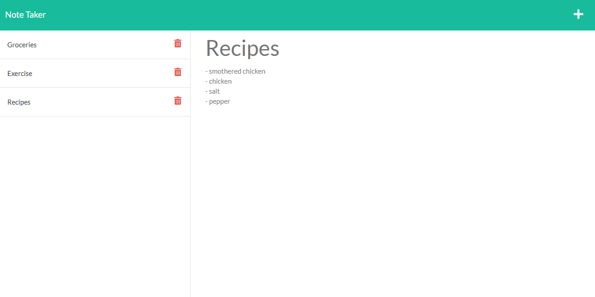
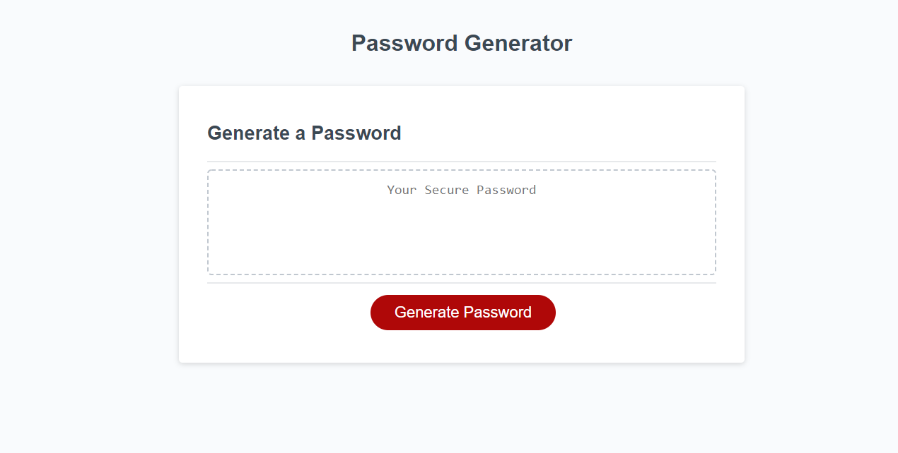
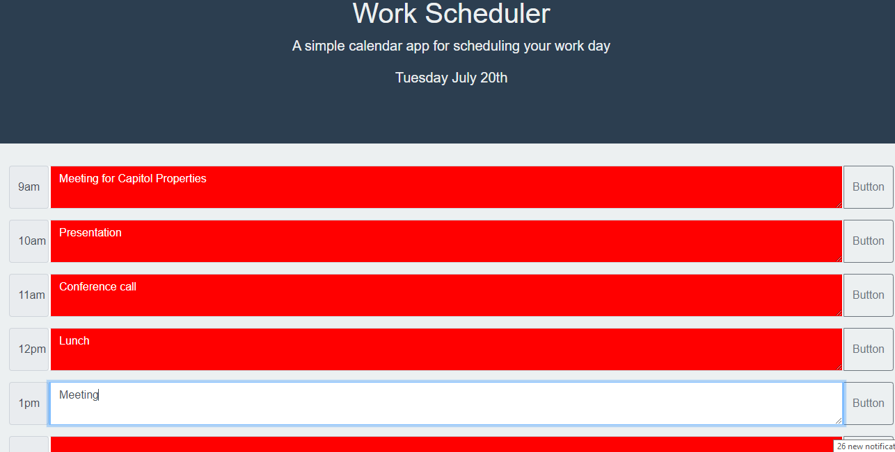

# Portfolio
This app is a responsive Portfolio that has visible applications. In this project, I created a portfolio to display my completed web development projects. This was built using HTML and CSS, and the style layout is mobile-first.

## Applications

